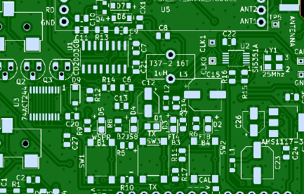
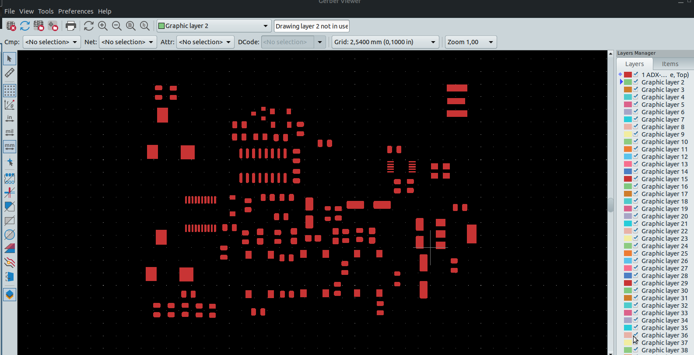
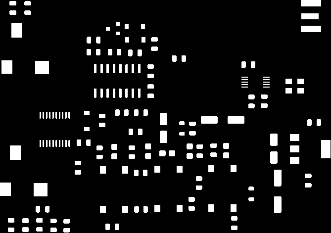
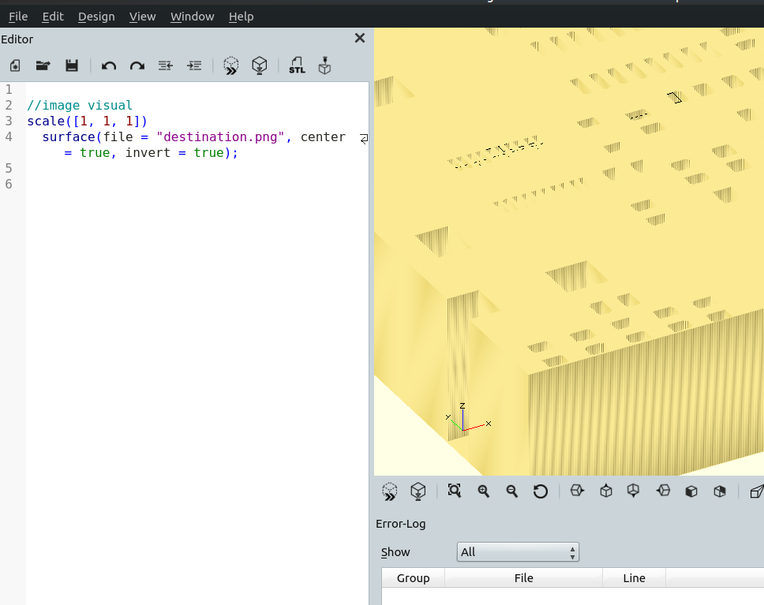
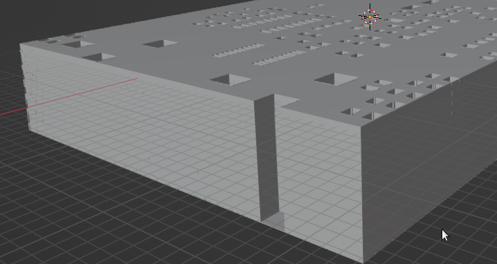
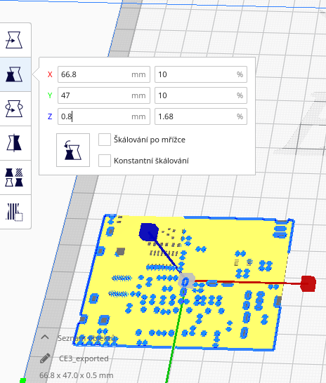
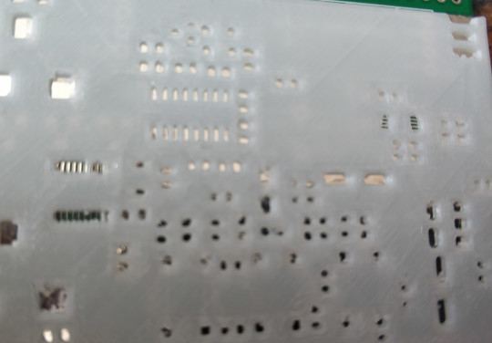

# Creating PCB stencil on 3D printer



Prove of concept. The Kicat provides vizualizer for pcb gerber files, see bellow. So it should be possible to read this data and create some 3d model.


 Base on gerber files format it quite chalange to understand it. Multiple dimension array of objects and different format in CNC like format.
 But I found an easy way:

# Starting wiht creation of 3d model


## Install what is required
Install python library:
```
pip install pcb-tools
pip install pycairo
pip install numpy
pip install pillow
```

## Convert gerber to picture
I have used what is already there and wrote simplex program which reads gerber files, create image from it. The image will be converted to black and white only.

```
destination="destination.png"
gerberToPNG("front-paste.gbr",destination);

convert-gbr-png.py
```
It will read the file front-paste.gbr and create file destination.png



## Postprocessing of picture

Openscad provide way to create 3d model from picture. 
Just open openscad file in same folder, when you have stored result destination.png
```
generate-stl.scad              -- remove  the bottom problems, suitable for postprocessing
generate-stl-withBottom.scad   -- generate just an model, but it will have no holes on the bottom :(
```



The example how it looks like with bottom line, this line is unwanted.



After processing in openscad, press F6 and export to stl.
You can process model directly (without bottom part - long processing in openscad) or customize it further in Blender (more quicker way) or any other 3d modeling SW.

So when you will have prepared stl without bottom part, you are ready to print it.

## Print
Before printing you have to set proper size of the stencil. This can be customized in your printing program.
In my case was the former size 470mm instead of required 47mm.
And I also adjust height to 0.8mm only, probably I would make some testing for optimal heigh.



3D view on object with bottom line:
[Ouptput](./ARCHIVE/generate-stl-withBottom.stl)


## Result from print

Outpur review:
[Ouptput](./ARCHIVE/generate-stl-automaticaly.stl)



It is not posible to use stencil without further adjusting with knife. Not suitable for contacts with distance less then 0.2mm (without some adjustment).

It will depends on your printer slicer, but in "Cura" there is an option for "HOLE horizontal expansion".
If your printed holes are smaller, then you need add -sign, for covering holes +.
In my case -0.1 result in afordable printing.

There are several videos :
https://www.youtube.com/results?search_query=cura+hole+horizontal

