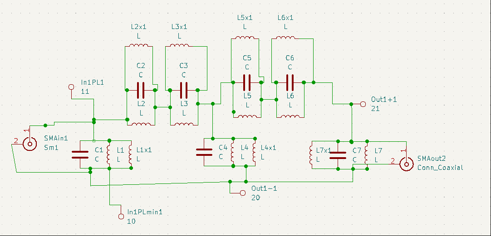

# General use
This filter contain classical components with ferrit core, which can custom base on demand.
Filter2 is base on smd components.

Current dessing support majority of classical filters. You can select circuits base on your needs. Just use
https://rf-tools.com/lc-filter/ or any other tools.

# Type of filters
## A) filter.zip

## B) filter2.zip

# Schematic

Components can be select to create required schema base on wish. More then 7 different models of band pass filter are supported.
